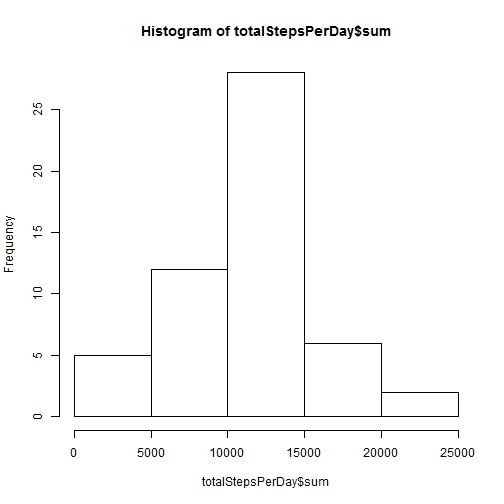
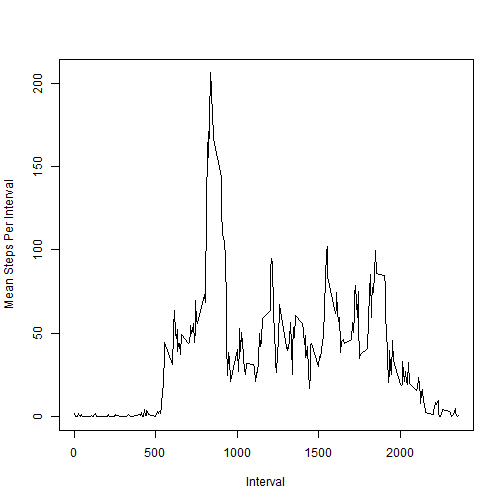
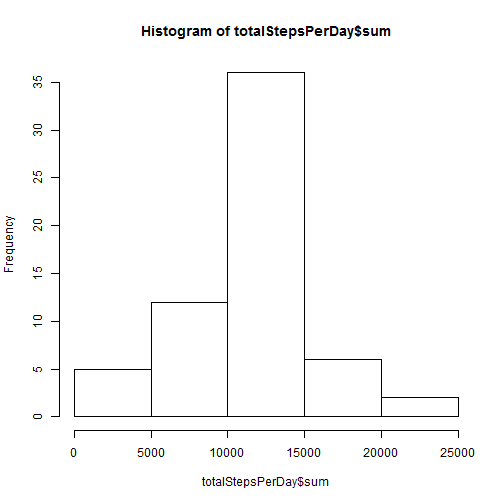
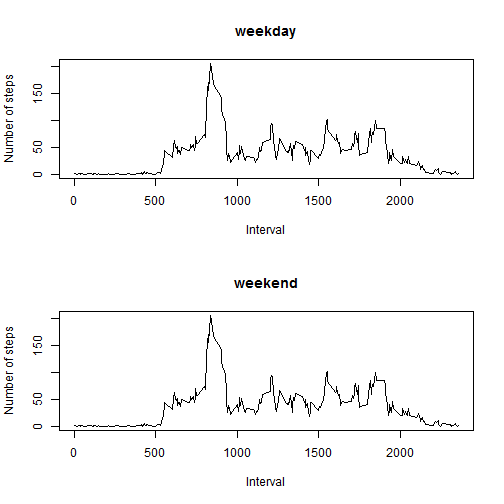

## Loading and preprocessing the data
### Load the Data

```r
## Load the data from the CSV into a variable
csvDataAll = read.csv("activity.csv")
```
### Process/transform the data (if necessary) into a format suitable for your analysis


```r
## remove all NA values from the set
csvData = csvDataAll[complete.cases(csvDataAll),]
```

## What is mean total number of steps taken per day?
### Make a histogram of the total number of steps taken each day

```r
## load the library dplyr
library(plyr)
library(dplyr)

## Make a histogram of total number of steps taken each day 
## we also have to ignore any missing values in the set.

# calculate the total number of steps per day
totalStepsPerDay=ddply(csvData, .(date),summarise,sum=sum(steps))

# make a histogram of total number of steps taken each day 
hist(totalStepsPerDay$sum)
```

 

### Calculate and report the mean and median total number of steps taken per day

```r
# mean and median of total numer of steps taken per day.
# here we will first take the sum of all the steps per day. Here we would get a total of 53 values (For 7 days the data is NA and we are instructed to ignore missing values). So the mean would be (total of all the steps/53)
meanSteps=mean(totalStepsPerDay$sum)
medianSteps=median(totalStepsPerDay$sum)
```

The mean total number of steps taken per day is 1.0766189 &times; 10<sup>4</sup>  
The median total number of steps taken per day is 10765

## What is the average daily activity pattern?

### Make a time series plot (i.e. type = "l") of the 5-minute interval (x-axis) and the average number of steps taken, averaged across all days (y-axis)

```r
# Calculate the mean number of steps taken in a given interval across all days
meanStepsPerInterval = ddply(csvData, .(interval),summarise,mean=mean(steps))

#Plot the time series plot for 5 minute interval and average number of steps taken, averaged across all days.
plot(meanStepsPerInterval$interval, meanStepsPerInterval$mean,type="l",ylab="Mean Steps Per Interval",xlab="Interval")
```

 

### Which 5-minute interval, on average across all the days in the dataset, contains the maximum number of steps?

```r
## select the row with the max number of steps which is averaged across al days 
maxIntervalRow=meanStepsPerInterval[meanStepsPerInterval$mean==max(meanStepsPerInterval$mean),]

maxInterval = maxIntervalRow$interval
```
The 5-minute interval, which on average across all the days in the dataset, contains the maximum number of steps is 835

## Imputing missing values
### Calculate and report the total number of missing values in the dataset (i.e. the total number of rows with NAs)

```r
# difference in the total number of records from the original data and the data extracted after removing NA values will give us the missing value data set
missingValue = nrow(csvDataAll) - nrow(csvData)
```

The total number of missing values in the dataset is 2304

### Devise a strategy for filling in all of the missing values in the dataset. The strategy does not need to be sophisticated. For example, you could use the mean/median for that day, or the mean for that 5-minute interval, etc.
We plan to take the mean of the 5 minute interval to fill up all the NA values for the given interval.

### Create a new dataset that is equal to the original dataset but with the missing data filled in.


```r
newCsvData = data.frame();

##make a logical sequence containing all the positions where we have na values
naValues=is.na(csvDataAll$steps)

## iterate through the logical sequence and where ever we find the na value to be true replace the value there.
count = 1;
for(i in naValues) 
{ 
  if(i == TRUE) 
  { 
    # get the data into a new variable.
    data = csvDataAll[count,]
    
    # select the interval value and get the appropriate details from the meanStepsPerInterval table
    interval = meanStepsPerInterval[(meanStepsPerInterval$interval== data$interval),]
    
    # insert the mean steps to the original data
    data$steps = interval$mean;
    newCsvData = rbind(newCsvData,data);
  } 
  else 
  {
    data = csvDataAll[count,];
    newCsvData = rbind(newCsvData,data);
  }
  
  count = count + 1;
}
```
### Make a histogram of the total number of steps taken each day.

```r
## Make a histogram of total number of steps taken each day 
## we also have to ignore any missing values in the set.

# calculate the total number of steps per day
totalStepsPerDay=ddply(newCsvData, .(date),summarise,sum=sum(steps))

# make a histogram of total number of steps taken each day 
hist(totalStepsPerDay$sum)
```

 

### Calculate and report the mean and median total number of steps taken per day. 

```r
# mean and median of total numer of steps taken per day.
# here we will first take the sum of all the steps per day. Here we would get a total of 53 values (For 7 days the data is NA and we are instructed to ignore missing values). So the mean would be (total of all the steps/53)
meanSteps=mean(totalStepsPerDay$sum)
medianSteps=median(totalStepsPerDay$sum)
```

The mean total number of steps taken per day is 1.0766189 &times; 10<sup>4</sup>  
The median total number of steps taken per day is 1.0766189 &times; 10<sup>4</sup>

### Do these values differ from the estimates from the first part of the assignment? 

The values do not vary significantly.

### What is the impact of imputing missing data on the estimates of the total daily number of steps?
There was no visible change when filling up the missing values with the strategy mentioned above.

## Are there differences in activity patterns between weekdays and weekends?
### Create a new factor variable in the dataset with two levels - "weekday" and "weekend" indicating whether a given date is a weekday or weekend day.

```r
# get the factor variable which contains true if the day is weekend and false if the day is not a weekend
weekDayFac=as.factor(weekdays(as.Date(newCsvData$date)) %in% c("Saturday","Sunday"))

# revalue the factor variables
weekDayFac = revalue(weekDayFac,c("TRUE"="weekend","FALSE"="weekday"))

## add this factor variable to the new data set
newCsvData$day = weekDayFac;
```

### Make a panel plot containing a time series plot (i.e. type = "l") of the 5-minute interval (x-axis) and the average number of steps taken, averaged across all weekday days or weekend days (y-axis). 


```r
## create a data frame with mean steps on a weekday
meanStepsPerIntervalWeekDay = ddply(newCsvData[(newCsvData$day=="weekday"),], .(interval),summarise,mean=mean(steps))

## create a data frame with mean steps on a weekend
meanStepsPerIntervalWeekEnd = ddply(newCsvData[(newCsvData$day=="weekend"),], .(interval),summarise,mean=mean(steps))

## plot the graph
par(mfrow=c(2,1))

plot(meanStepsPerIntervalWeekDay$interval, meanStepsPerInterval$mean,type="l",ylab="Number of steps",xlab="Interval")
title(main="weekday")

plot(meanStepsPerIntervalWeekEnd$interval, meanStepsPerInterval$mean,type="l",ylab="Number of steps",xlab="Interval")
title(main="weekend")
```

 
